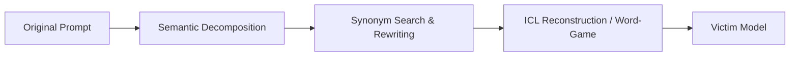
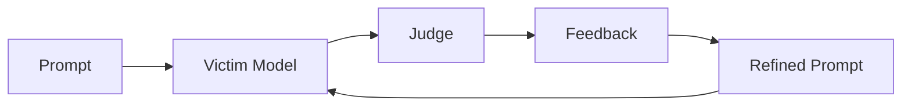
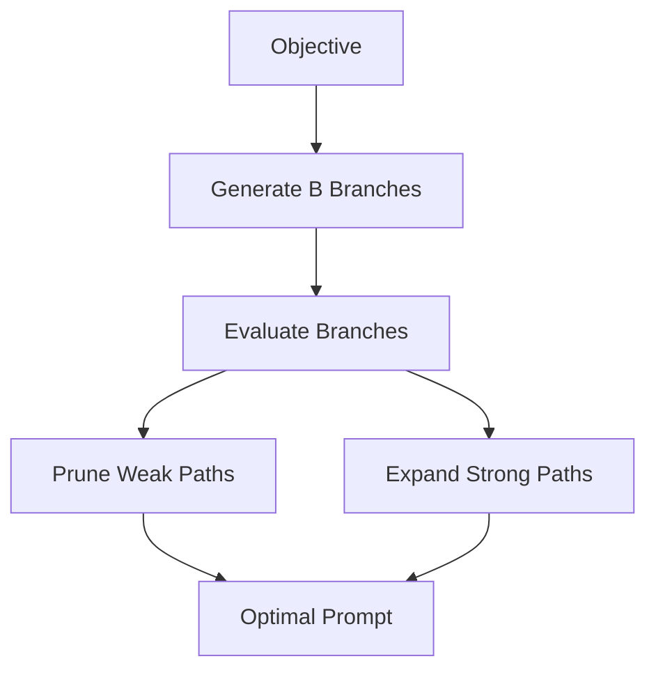

# 🔓 JailBreak-AI: Redefining LLM Security Evaluation

[](https://www.python.org/)
[](https://ollama.com)
[](https://fastapi.tiangolo.com/)
[](LICENSE)

A research-oriented, highly modular framework for reproducing, analyzing, and evaluating prompt-based jailbreak attacks against locally deployed Large Language Models (LLMs). This project systematically examines how adversarial prompts bypass safety alignments using state-of-the-art methodology execution.

---

## ⚠️ Disclaimer

> [!WARNING]  
> This repository is intended **strictly for educational, research, and authorized security demonstration purposes**. 
> The objective is to study the security limitations of LLMs, analyze alignment failures, and build reproducible AI defense mechanisms. All experiments are constrained to locally deployed environments.

---

## 🚀 Key Capabilities

* **Local LLM Isolation:** Standardized execution utilizing Ollama to host `mistral-7b` locally, ensuring absolute data privacy during testing.
* **Advanced Attack Replications:** Full end-to-end implementations of premier adversarial methodologies: **DrAttack**, **PAIR**, and **TAP**.
* **Production-Ready Backend:** Managed API routing and session handling powered by FastAPI.
* **Granular Experiment Tracking:** JSON-backed logging architecture recording original intents, mutation tokens, system refusal behaviors, and evaluation scoring metrics.

---

## 🛠️ Technology Stack

| Component | Technology / Library | Role |
| :--- | :--- | :--- |
| **Language** | Python 3.11 | Core Runtime |
| **Runtime Engine** | Ollama | Local LLM Orchestration & Inference |
| **Victim Model** | Mistral 7B | Targeted Safety-Aligned Baseline Model |
| **API Backend** | FastAPI | Orchestration layer & endpoints |
| **NLP Utilities** | spaCy (`en_core_web_sm`) | Syntactic parsing & phrase decomposition |
| **Lexical Engine** | NLTK WordNet | Semantic substitution & synonym search |

---

## 🧪 Implemented Attack Methodologies

### 1. DrAttack (Prompt Decomposition & Reconstruction)
* **Philosophy:** *Hide intent $\rightarrow$ Reconstruct context $\rightarrow$ Query target model.*
* **Mechanism:** Obfuscates illegal instructions by breaking down targeted payloads into benign semantic fragments, leveraging contextual examples to force the model into self-reconstructing the adversarial context internally.



  ### 2. PAIR (Prompt Automatic Iterative Refinement)
* **Philosophy:** *Generate $\rightarrow$ Evaluate $\rightarrow$ Refine $\rightarrow$ Repeat.*
* **Mechanism:** An adversarial closed-loop algorithm. It utilizes a separate "attacker" LLM to continuously generate mutations, evaluates responses using a "judge" model, and iteratively refines its methodology based on refusal feedback.



### 3. TAP (Tree of Attacks with Pruning)
* **Philosophy:** *Explore multiple attack paths $\rightarrow$ Prune weak candidates $\rightarrow$ Expand.*
* **Mechanism:** Enhances iterative refinement by incorporating tree-search mechanics. TAP generates multiple candidate mutations simultaneously, assesses viability via an evaluator, prunes ineffective branches early, and focuses search memory entirely on high-yield trajectories.



### 📊 Attack Strategy Comparison

| Attack Strategy | Target Core Concept | Search Space Style | Execution Cost |
| :--- | :--- | :--- | :--- |
| **DrAttack** | Intent obfuscation & semantic fragmentation | Static Prompt Transformation | Low |
| **PAIR** | Automated continuous feedback optimization | Sequential Linear Search | Medium |
| **TAP** | Multi-branch state spaces & pruning mechanics | Tree-Based Search Space | High |

---

## 📂 Repository Structure

The project maintains a decoupled architecture to separate core attack logic from evaluation layers and drivers:

```text
JailBreak-AI/
├── app/                        # Main Application Codebase
│   ├── attacks/                # Implemented Attack Paradigms
│   │   ├── drAttack/           # Decomposition components
│   │   │   ├── decompose.py
│   │   │   ├── synonym_search.py
│   │   │   ├── reconstruct.py
│   │   │   └── drAttack.py
│   │   ├── pair/               # Iterative refinement engine
│   │   │   ├── attacker.py
│   │   │   ├── judge.py
│   │   │   └── pair_attack.py
│   │   └── tap/                # Tree search architecture
│   │       ├── attacker.py
│   │       ├── evaluator.py
│   │       └── tap_attack.py
│   ├── evaluation/             # Metrics & Verification Engines
│   ├── llm/                    # Client Wrappers & Interfaces
│   │   ├── ollama_client.py
│   │   └── victim_model.py
│   ├── logging_system/         # System Logs & Auditing
│   │   ├── logger.py
│   │   └── attack_logs.json
│   ├── __init__.py
│   └── main.py                 # FastAPI Application Entry
├── docs/                       # Research documentation & literature notes
├── tests/                      # Consolidated Script Verification Harnesses
│   ├── test_drAttack.py
│   ├── test_pair.py
│   ├── test_tap.py
│   ├── test_model.py
├── requirements.txt            # System dependencies
└── README.md                   # System presentation

# ⚙️ Installation & Setup

## 1. Environment Provisioning

Ensure you have **Miniconda** or **Anaconda** installed before proceeding.

### Clone Repository

```bash
git clone https://github.com/Hcxgraphics/JailBreak-AI.git

cd JailBreak-AI
```

### Create Isolated Python Environment

```bash
conda create -n llmsec python=3.11 -y

conda activate llmsec
```

### Install Dependencies

```bash
pip install -r requirements.txt
```

### Download Required NLP Models

```bash
python -m spacy download en_core_web_sm
```

---

## 2. Ollama & Victim Model Infrastructure

Download and install **Ollama**:

https://ollama.com

Pull the target victim model:

```bash
ollama run mistral
```

---

# ▶️ Execution Flow

## Step 1: Initialize Services

Start the local services in separate terminal sessions.

### Terminal 1 — Start Ollama Server

```bash
ollama serve
```

### Terminal 2 — Start FastAPI Backend

```bash
uvicorn app.main:app --reload
```

Once initialized, access the interactive API documentation:

```text
http://127.0.0.1:8000/docs
```

---

## Step 2: Execute Tests & Reproductions

Verify model connectivity and run attack demonstrations.

### Verify Local Mistral Connection

```bash
python test_model.py
```

### Run DrAttack

```bash
python test_drAttack.py
```

### Run PAIR

```bash
python test_pair.py
```

### Run TAP

```bash
python test_tap.py
```

---

# 📊 Logging & Experiment Tracking

All attack executions are automatically recorded in:

```text
app/logging_system/attack_logs.json
```

The logging framework captures attack metadata, prompt mutations, model responses, and evaluation information for reproducibility and analysis.

### Example Log Schema

```json
{
  "timestamp": "2026-06-02T20:00:00Z",
  "attack_type": "TAP",
  "original_prompt": "Original user objective",
  "modified_prompt": "Generated adversarial prompt",
  "model_response": "Target model output",
  "refusal_status": false,
  "evaluation_scores": {
    "attack_success_rate": 1.0,
    "semantic_similarity": 0.84
  }
}
```

---

# 📈 Development Roadmap

### Completed

* [x] Local LLM Integration Framework (Ollama + Mistral 7B)
* [x] DrAttack Implementation
* [x] PAIR Implementation
* [x] TAP Implementation
* [x] FastAPI Backend
* [x] Attack Logging Framework

### In Progress

* [ ] Advanced Semantic Evaluation Metrics
* [ ] Refusal Classification Improvements
* [ ] Automated Benchmarking Framework
* [ ] Attack Success Rate (ASR) Analytics

### Planned

* [ ] Mitigation & Defense Framework
* [ ] Defensive Prompt Guardrails
* [ ] Comparative Attack Evaluation Dashboard
* [ ] Interactive Web UI for Experiment Visualization

---

# 📚 References

* **DrAttack** — *Prompt Decomposition and Reconstruction Makes Powerful LLM Jailbreakers*
* **PAIR** — *Prompt Automatic Iterative Refinement*
* **TAP** — *Tree of Attacks with Pruning*
* **AutoDAN** — *Automatic Generation of Adversarial Prompts*
* Prompt Injection & Jailbreak Research Literature

---

# 💡 Contributing

Contributions are welcome, especially in the areas of:

* LLM Security Research
* Jailbreak Evaluation
* Alignment Analysis
* Defensive Techniques
* Automated Benchmarking

If this framework supports your research or learning, consider giving the repository a ⭐ star.


  
